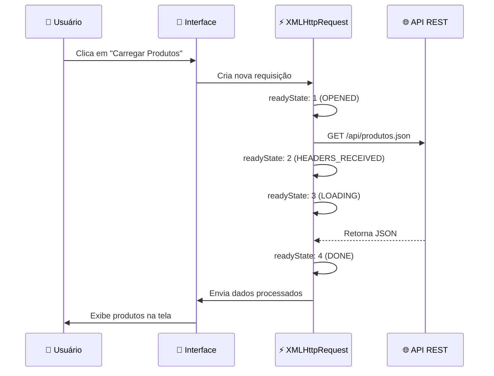

<!-- Hero Section -->
<div align="center">


<br><br>


<br>

**Uma demonstração completa de como construir aplicações web modernas usando apenas JavaScript puro**

[🎯 Objetivo](#-objetivo-do-projeto) • [⚡ Features](#-features-implementadas) • [🏗️ Arquitetura](#️-arquitetura) • [🚀 Como Usar](#-como-usar) • [📚 Aprendizado](#-o-que-você-vai-aprender)

</div>

---


<!-- Project Overview -->
## 🎯 **Objetivo do Projeto**

<table>
<tr>
<td width="60%">

### 💡 **Por que este projeto existe?**

Este projeto foi criado para **demonstrar na prática** como funciona o **processamento assíncrono** em aplicações web reais. Através de um e-commerce funcional, você vai entender:

- 🔄 Como o **XMLHttpRequest** gerencia requisições HTTP
- 📡 Comunicação com APIs REST sem recarregar a página
- 🎨 Atualização dinâmica da interface do usuário
- ⚡ Criação de experiências fluidas e responsivas

**Tudo isso sem usar frameworks ou bibliotecas externas!**

</td>
<td width="40%">


</td>
</tr>
</table>


<!-- Features -->
## ⚡ **Features Implementadas**

<div align="center">

### **Funcionalidades do E-Commerce**

<table>
<tr>
<td align="center" width="33%">

### 🛍️ **Catálogo**


Carregamento assíncrono de produtos com imagens, descrições e preços dinâmicos

</td>
<td align="center" width="33%">

### 🔍 **Busca**


Filtro instantâneo de produtos enquanto você digita, sem delays

</td>
<td align="center" width="33%">

### 🛒 **Carrinho**


Adicione/remova itens com feedback visual e contador atualizado

</td>
</tr>
</table>

<table>
<tr>
<td align="center" width="50%">

### 📊 **Estatísticas**


Acompanhe requisições, tempo de resposta e performance em tempo real

</td>
<td align="center" width="50%">

### 🎨 **UI Moderna**


Design limpo, animações suaves e totalmente adaptável a qualquer tela

</td>
</tr>
</table>

</div>


<!-- Architecture -->
## 🏗️ **Arquitetura**

<div align="center">

### **Fluxo de Requisição XMLHttpRequest**



</div>

### 📦 **Estrutura Modular**

<div align="center">

```
┌─────────────────────────────────────────────────────────┐
│                    🌐 index.html                        │
│                  (Interface Principal)                   │
└─────────────────────────────────────────────────────────┘
                           │
        ┌──────────────────┼──────────────────┐
        ▼                  ▼                  ▼
┌───────────────┐  ┌───────────────┐  ┌───────────────┐
│ ajax-handler  │  │   products    │  │     cart      │
│      .js      │◄─┤      .js      │  │     .js       │
│               │  │               │  │               │
│ Gerencia XHR  │  │ Exibe Produtos│  │ Gerencia Itens│
└───────────────┘  └───────────────┘  └───────────────┘
        │                  
        ▼                  
┌───────────────┐          
│     stats     │          
│      .js      │          
│               │          
│ Monitora API  │          
└───────────────┘          
        │
        ▼
┌───────────────┐
│ produtos.json │
│   (Mock API)  │
└───────────────┘
```

</div>


<!-- Technology Stack -->
## 🛠️ **Stack Tecnológica**

<div align="center">

### **Tecnologias Utilizadas**

<table>
<tr>
<td align="center" width="25%">
<br>
<b>HTML5</b><br>
<sub>Estrutura Semântica</sub>
</td>
<td align="center" width="25%">
<br>
<b>CSS3</b><br>
<sub>Flexbox, Grid, Animations</sub>
</td>
<td align="center" width="25%">
<br>
<b>JavaScript ES6+</b><br>
<sub>XMLHttpRequest, Classes</sub>
</td>
<td align="center" width="25%">
<br>
<b>JSON</b><br>
<sub>Formato de Dados</sub>
</td>
</tr>
</table>

### ✨ **Sem Dependências Externas**


</div>


<!-- How to Use -->
## 🚀 **Como Usar**

<div align="center">

### **Comece em 3 Passos Simples**

</div>

<table>
<tr>
<td width="33%" align="center">

### 1️⃣ **Clone**

```bash
git clone https://github.com/
joaogalimberti/
ecommerce-xhr-demo.git
```


</td>
<td width="33%" align="center">

### 2️⃣ **Servidor**

```bash
cd ecommerce-xhr-demo

python -m http.server 8000
```


</td>
<td width="33%" align="center">

### 3️⃣ **Abra**

```bash
http://localhost:8000
```


</td>
</tr>
</table>

<div align="center">

### **Alternativas de Servidor Local**

| Método | Comando | Link |
|--------|---------|------|
| 🐍 **Python 3** | `python -m http.server 8000` | localhost:8000 |
| 🐍 **Python 2** | `python -m SimpleHTTPServer 8000` | localhost:8000 |
| 📦 **Node.js** | `npx http-server -p 8000` | localhost:8000 |
| 🐘 **PHP** | `php -S localhost:8000` | localhost:8000 |
| ⚡ **VS Code** | Live Server Extension | Auto |

</div>


<!-- XMLHttpRequest States -->
## 🔄 **Estados do XMLHttpRequest**

<div align="center">

### **Ciclo de Vida da Requisição**

<table>
<tr>
<th>Estado</th>
<th>readyState</th>
<th>Descrição</th>
<th>O que acontece</th>
</tr>
<tr>
<td align="center">🔵</td>
<td><code>0</code> UNSENT</td>
<td>Objeto criado</td>
<td><code>new XMLHttpRequest()</code></td>
</tr>
<tr>
<td align="center">🟡</td>
<td><code>1</code> OPENED</td>
<td>Conexão aberta</td>
<td><code>xhr.open('GET', url)</code></td>
</tr>
<tr>
<td align="center">🟠</td>
<td><code>2</code> HEADERS_RECEIVED</td>
<td>Headers recebidos</td>
<td>Servidor respondeu</td>
</tr>
<tr>
<td align="center">🟣</td>
<td><code>3</code> LOADING</td>
<td>Baixando dados</td>
<td>Transferência em andamento</td>
</tr>
<tr>
<td align="center">🟢</td>
<td><code>4</code> DONE</td>
<td>Operação completa</td>
<td>Dados prontos para uso</td>
</tr>
</table>

</div>

### 📊 **Códigos de Status HTTP**

<div align="center">

| Código | Status | Significado | Ação |
|--------|--------|-------------|------|
| `200` | ✅ OK | Sucesso | Processar dados |
| `201` | ✅ Created | Recurso criado | Confirmar criação |
| `400` | ❌ Bad Request | Requisição inválida | Validar dados |
| `404` | ❌ Not Found | Não encontrado | Verificar URL |
| `500` | ❌ Server Error | Erro no servidor | Tentar novamente |

</div>


<!-- Learning -->
## 📚 **O que você vai aprender**

<div align="center">

<table>
<tr>
<td width="50%">

### 🎓 **Conceitos Técnicos**

- ✅ Programação assíncrona em JavaScript
- ✅ Requisições HTTP (GET, POST, PUT, DELETE)
- ✅ Manipulação do DOM de forma eficiente
- ✅ Tratamento de erros e estados de loading
- ✅ Gerenciamento de dados JSON
- ✅ Arquitetura modular de aplicações

</td>
<td width="50%">

### 💼 **Habilidades Práticas**

- 🛠️ Construir SPAs sem frameworks
- 🎨 Criar interfaces responsivas e modernas
- 📡 Integrar com APIs REST
- ⚡ Otimizar performance de aplicações
- 🐛 Debug de requisições assíncronas
- 📱 Desenvolver para múltiplos dispositivos

</td>
</tr>
</table>

</div>


<!-- Project Structure -->
## 📁 **Estrutura do Projeto**

```
📦 ecommerce-xhr-demo
 ┃
 ┣ 📂 css/
 ┃ ┗ 📜 style.css              ← Estilos responsivos e animações
 ┃
 ┣ 📂 js/
 ┃ ┣ 📜 ajax-handler.js        ← Gerenciador de XMLHttpRequest
 ┃ ┣ 📜 products.js            ← Lógica de produtos (carregar/exibir)
 ┃ ┣ 📜 cart.js               ← Sistema de carrinho de compras
 ┃ ┗ 📜 stats.js              ← Monitoramento de performance
 ┃
 ┣ 📂 api/
 ┃ ┗ 📜 produtos.json         ← Mock API com 12 produtos
 ┃
 ┣ 📜 index.html               ← Página principal
 ┣ 📜 README.md                ← Documentação
 ┗ 📜 LICENSE                  ← MIT License
```


<!-- Browser Support -->
## 🌐 **Compatibilidade**

<div align="center">

### **Suporte a Navegadores Modernos**

|  |  |  |  |  |
|---------|---------|--------|------|-------|
| Chrome 60+ | Firefox 55+ | Safari 11+ | Edge 79+ | Opera 47+ |
| ✅ Completo | ✅ Completo | ✅ Completo | ✅ Completo | ✅ Completo |

</div>


<!-- Academic Context -->
## 🎓 **Contexto Acadêmico**

<div align="center">

<table>
<tr>
<td align="center" width="50%">

### 📚 **Informações do Projeto**

**Instituição:** UCL - Universidade Centro Leste  
**Curso:** Análise e Desenvolvimento de Sistemas  
**Disciplina:** Arquitetura de Interoperabilidade Web  
**Ano:** 2025

</td>
<td align="center" width="50%">

### 🎯 **Objetivos Educacionais**

Demonstrar conceitos fundamentais de:
- Comunicação assíncrona
- APIs REST
- JavaScript moderno
- Arquitetura web

</td>
</tr>
</table>

</div>


<!-- Contributing -->
## 🤝 **Como Contribuir**

<div align="center">

**Contribuições são bem-vindas!** 🎉

</div>

```bash
# 1. Fork o projeto
# 2. Crie uma branch para sua feature
git checkout -b feature/MinhaFeature

# 3. Commit suas mudanças
git commit -m 'feat: Adiciona MinhaFeature'

# 4. Push para a branch
git push origin feature/MinhaFeature

# 5. Abra um Pull Request
```

<div align="center">

### **Padrões de Commit**

| Tipo | Descrição | Exemplo |
|------|-----------|---------|
| `feat` | Nova funcionalidade | `feat: Adiciona filtro por preço` |
| `fix` | Correção de bug | `fix: Corrige erro no carrinho` |
| `docs` | Documentação | `docs: Atualiza README` |
| `style` | Formatação | `style: Ajusta indentação` |
| `refactor` | Refatoração | `refactor: Melhora estrutura` |

</div>


<!-- License -->
## 📄 **Licença**

<div align="center">

Este projeto está sob a licença **MIT**

```
Copyright (c) 2025 João Galimberti

É permitido usar, copiar, modificar e distribuir este projeto
para fins educacionais e comerciais.
```

[](LICENSE)

</div>


<!-- Contact -->
## 📬 **Contato**

<div align="center">

### **Tem dúvidas ou sugestões?**

[](mailto:joaogalimberti@gmail.com)
[](https://www.linkedin.com/in/joaogalimberti/)
[](https://github.com/joaogalimberti)

</div>

---

<div align="center">


**Desenvolvido por [João Galimberti](https://github.com/joaogalimberti) | 2025**

</div>
