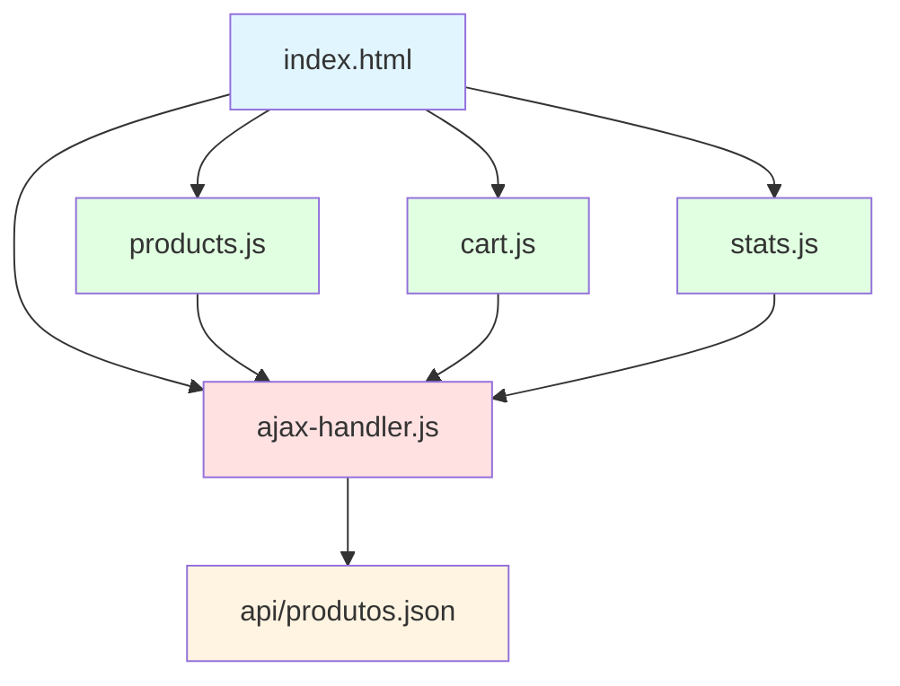

# 🛒 E-Commerce Brasil - XMLHttpRequest Implementation

<div align="center">


**Demonstração completa de processamento assíncrono com XMLHttpRequest para aplicações e-commerce**

[📚 Documentação](#-documentação) • [🚀 Quick Start](#-quick-start) • [💻 Implementação](#-guia-de-implementação) • [🎯 Exemplos](#-exemplos-práticos)

</div>

---

## 📋 Índice

- [Sobre o Projeto](#-sobre-o-projeto)
- [Tecnologias Utilizadas](#-tecnologias-utilizadas)
- [Estrutura do Projeto](#-estrutura-do-projeto)
- [Quick Start](#-quick-start)
- [Como Funciona o XMLHttpRequest](#-como-funciona-o-xmlhttprequest)
- [Guia de Implementação](#-guia-de-implementação)
- [Exemplos Práticos](#-exemplos-práticos)
- [Customização](#-customização)
- [Troubleshooting](#-troubleshooting)
- [Contribuindo](#-contribuindo)

---

## 🎯 Sobre o Projeto

Este projeto demonstra a implementação **profissional** de **processamento assíncrono de dados** utilizando o objeto **XMLHttpRequest** para comunicação com APIs REST em uma aplicação e-commerce real.

### 🎓 Objetivos Educacionais

✅ Entender o ciclo completo de uma requisição assíncrona  
✅ Implementar comunicação com APIs REST  
✅ Manipular o DOM dinamicamente  
✅ Gerenciar estados de loading e erros  
✅ Criar experiências de usuário modernas  

### 🌟 Features Implementadas

- ⚡ **Requisições Assíncronas** - Sem recarregar a página
- 🔍 **Busca em Tempo Real** - Filtro instantâneo de produtos
- 🛒 **Carrinho Funcional** - Adicionar/remover itens
- 📊 **Estatísticas Live** - Monitoramento de performance
- 🎨 **UI Moderna** - Design responsivo e animado
- 🔔 **Notificações** - Feedback visual para o usuário
- 📱 **Mobile-First** - Totalmente responsivo

---

## 🛠 Tecnologias Utilizadas

| Tecnologia | Versão | Descrição |
|-----------|--------|-----------|
| **HTML5** | Latest | Estrutura semântica |
| **CSS3** | Latest | Estilização moderna (Flexbox, Grid, Animations) |
| **JavaScript** | ES6+ | Lógica de negócio e XMLHttpRequest |
| **JSON** | - | Formato de dados da API |

**Sem dependências externas!** 🎉 Projeto 100% Vanilla JavaScript.

---

## 📁 Estrutura do Projeto

```
ecommerce-xhr-demo/
│
├── 📄 index.html                 # Página principal
├── 📄 README.md                  # Este arquivo
├── 📄 .gitignore                 # Arquivos ignorados pelo Git
│
├── 📁 css/
│   └── 📄 style.css              # Estilos globais e responsivos
│
├── 📁 js/
│   ├── 📄 ajax-handler.js        # Classe gerenciadora de XHR
│   ├── 📄 products.js            # Módulo de produtos
│   ├── 📄 cart.js                # Gerenciamento do carrinho
│   └── 📄 stats.js               # Estatísticas em tempo real
│
└── 📁 api/
    └── 📄 produtos.json          # Mock da API (12 produtos)
```

### 📊 Arquitetura Modular



---

## 🚀 Quick Start

### 1️⃣ Clone o Repositório

```bash
git clone https://github.com/joaogalimberti/ecommerce-xhr-demo.git
cd ecommerce-xhr-demo
```

### 2️⃣ Abra o Projeto

**Opção A: Servidor Local (Recomendado)**

```bash
# Python 3
python -m http.server 8000

# Python 2
python -SimpleHTTPServer 8000

# Node.js (requer npx)
npx http-server -p 8000

# PHP
php -S localhost:8000
```

Acesse: **http://localhost:8000**

**Opção B: VS Code Live Server**

1. Instale a extensão **"Live Server"**
2. Clique com botão direito em `index.html`
3. Selecione **"Open with Live Server"**

**Opção C: Diretamente pelo arquivo**

```bash
# Windows
start index.html

# Mac
open index.html

# Linux
xdg-open index.html
```

> ⚠️ **Importante:** Alguns recursos podem não funcionar corretamente ao abrir o arquivo diretamente devido a restrições de CORS.

---

## 🔄 Como Funciona o XMLHttpRequest

### 📖 Ciclo Completo da Requisição

```
┌─────────────────────────────────────────────────────────────┐
│  1. EVENTO DO USUÁRIO                                       │
│     └─→ Click, submit, load, etc.                          │
└─────────────────────────────────────────────────────────────┘
                            ↓
┌─────────────────────────────────────────────────────────────┐
│  2. CRIAR XMLHttpRequest                                    │
│     const xhr = new XMLHttpRequest();                       │
└─────────────────────────────────────────────────────────────┘
                            ↓
┌─────────────────────────────────────────────────────────────┐
│  3. CONFIGURAR REQUISIÇÃO                                   │
│     xhr.open('GET', 'api/produtos.json', true);            │
│     xhr.setRequestHeader('Content-Type', 'application/json');│
└─────────────────────────────────────────────────────────────┘
                            ↓
┌─────────────────────────────────────────────────────────────┐
│  4. DEFINIR CALLBACKS                                       │
│     xhr.onreadystatechange = function() { ... }            │
└─────────────────────────────────────────────────────────────┘
                            ↓
┌─────────────────────────────────────────────────────────────┐
│  5. ENVIAR REQUISIÇÃO                                       │
│     xhr.send();                                             │
└─────────────────────────────────────────────────────────────┘
                            ↓
┌─────────────────────────────────────────────────────────────┐
│  6. SERVIDOR PROCESSA                                       │
│     └─→ API REST retorna JSON                              │
└─────────────────────────────────────────────────────────────┘
                            ↓
┌─────────────────────────────────────────────────────────────┐
│  7. MONITORAMENTO DE ESTADOS                                │
│     readyState: 1 → 2 → 3 → 4                              │
└─────────────────────────────────────────────────────────────┘
                            ↓
┌─────────────────────────────────────────────────────────────┐
│  8. RECEBIMENTO DA RESPOSTA                                 │
│     status: 200 (Success) ou 4xx/5xx (Error)              │
└─────────────────────────────────────────────────────────────┘
                            ↓
┌─────────────────────────────────────────────────────────────┐
│  9. PROCESSAR DADOS                                         │
│     const data = JSON.parse(xhr.responseText);             │
└─────────────────────────────────────────────────────────────┘
                            ↓
┌─────────────────────────────────────────────────────────────┐
│  10. ATUALIZAR DOM                                          │
│      └─→ Interface atualizada dinamicamente                │
└─────────────────────────────────────────────────────────────┘
```

### 📊 Estados do readyState

| Valor | Constante | Descrição | Quando Acontece |
|-------|-----------|-----------|-----------------|
| `0` | UNSENT | Objeto criado | `new XMLHttpRequest()` |
| `1` | OPENED | Conexão aberta | Após `open()` |
| `2` | HEADERS_RECEIVED | Headers recebidos | Após `send()` |
| `3` | LOADING | Baixando dados | Durante download |
| `4` | DONE | Operação completa | Resposta completa |

### 🎯 Códigos de Status HTTP

| Código | Tipo | Significado | Ação |
|--------|------|-------------|------|
| `200` | ✅ Success | OK | Processar dados |
| `201` | ✅ Success | Created | Recurso criado |
| `204` | ✅ Success | No Content | Sucesso sem resposta |
| `400` | ❌ Error | Bad Request | Validar entrada |
| `401` | ❌ Error | Unauthorized | Verificar auth |
| `404` | ❌ Error | Not Found | Endpoint inválido |
| `500` | ❌ Error | Server Error | Tentar novamente |

---

## 💻 Guia de Implementação

### 🎯 PASSO 1: Criar a Estrutura Base

#### 1.1 Arquivo HTML

Crie `index.html` com a estrutura básica:

```html
<!DOCTYPE html>
<html lang="pt-BR">
<head>
    <meta charset="UTF-8">
    <meta name="viewport" content="width=device-width, initial-scale=1.0">
    <title>E-Commerce - XMLHttpRequest</title>
    <link rel="stylesheet" href="css/style.css">
</head>
<body>
    <!-- Conteúdo aqui -->
    
    <!-- IMPORTANTE: Ordem dos scripts importa! -->
    <script src="js/ajax-handler.js"></script>
    <script src="js/products.js"></script>
    <script src="js/cart.js"></script>
    <script src="js/stats.js"></script>
</body>
</html>
```

> 💡 **Dica:** A ordem dos scripts é crucial! `ajax-handler.js` deve vir primeiro pois é usado pelos outros módulos.

---

### 🎯 PASSO 2: Implementar o Gerenciador XHR

#### 2.1 Criar `js/ajax-handler.js`

Este é o **coração** do sistema de requisições:

```javascript
class AjaxHandler {
    /**
     * Requisição GET assíncrona
     * @param {string} url - Endpoint da API
     * @param {function} onSuccess - Callback de sucesso
     * @param {function} onError - Callback de erro
     */
    static get(url, onSuccess, onError) {
        // PASSO 1: Criar objeto
        const xhr = new XMLHttpRequest();
        
        // PASSO 2: Monitorar estado
        xhr.onreadystatechange = function() {
            if (xhr.readyState === 4) {
                if (xhr.status === 200) {
                    try {
                        const data = JSON.parse(xhr.responseText);
                        onSuccess(data);
                    } catch (e) {
                        onError('Erro ao processar: ' + e.message);
                    }
                } else {
                    onError(`Erro HTTP: ${xhr.status}`);
                }
            }
        };
        
        // PASSO 3: Configurar
        xhr.open('GET', url, true); // true = assíncrono
        xhr.setRequestHeader('Content-Type', 'application/json');
        
        // PASSO 4: Enviar
        xhr.send();
        
        return xhr;
    }
}
```

#### 🔍 Explicação Linha por Linha

```javascript
// Linha 1-6: Definição da classe e método estático
// Método estático permite chamar AjaxHandler.get() sem instanciar

// Linha 8: Criar instância do XMLHttpRequest
const xhr = new XMLHttpRequest();
// ↪ Cria objeto que gerencia a requisição

// Linha 11: Callback executado a cada mudança de estado
xhr.onreadystatechange = function() {
// ↪ Será chamado 4 vezes: readyState 1, 2, 3, 4

// Linha 12: Verifica se requisição completou
if (xhr.readyState === 4) {
// ↪ readyState 4 = DONE (operação finalizada)

// Linha 13: Verifica se foi sucesso
if (xhr.status === 200) {
// ↪ status 200 = OK

// Linha 15: Converte JSON string para objeto
const data = JSON.parse(xhr.responseText);
// ↪ responseText contém a resposta como string

// Linha 16: Chama função de sucesso com dados
onSuccess(data);

// Linha 26: Configura método, URL e modo
xhr.open('GET', url, true);
// ↪ GET = método HTTP
// ↪ url = endpoint da API
// ↪ true = ASSÍNCRONO (não bloqueia navegador)

// Linha 27: Define tipo de conteúdo
xhr.setRequestHeader('Content-Type', 'application/json');

// Linha 30: Envia requisição ao servidor
xhr.send();
```

#### 🛡️ Tratamento de Erros Robusto

Adicione timeout e error handlers:

```javascript
// Timeout (tempo máximo de espera)
xhr.timeout = 10000; // 10 segundos
xhr.ontimeout = function() {
    onError('Tempo limite excedido');
};

// Erro de rede
xhr.onerror = function() {
    onError('Erro de conexão');
};

// Requisição cancelada
xhr.onabort = function() {
    console.log('Requisição cancelada');
};
```

---

### 🎯 PASSO 3: Carregar Produtos Dinamicamente

#### 3.1 Criar `js/products.js`

```javascript
// Aguardar DOM estar pronto
document.addEventListener('DOMContentLoaded', function() {
    carregarProdutos();
});

function carregarProdutos() {
    // 1. Mostrar loading
    AjaxHandler.toggleLoading(true);
    
    // 2. Fazer requisição
    AjaxHandler.get(
        'api/produtos.json',
        
        // 3. Callback de SUCESSO
        function(data) {
            console.log('✅ Dados recebidos:', data);
            
            exibirProdutos(data.produtos);
            AjaxHandler.toggleLoading(false);
            
            mostrarNotificacao('Produtos carregados!', 'success');
        },
        
        // 4. Callback de ERRO
        function(erro) {
            console.error('❌ Erro:', erro);
            
            AjaxHandler.toggleLoading(false);
            mostrarNotificacao('Erro: ' + erro, 'error');
        }
    );
}
```

#### 📦 Criar Cards de Produtos no DOM

```javascript
function exibirProdutos(produtos) {
    const container = document.getElementById('produtos-container');
    
    // Limpar conteúdo anterior
    container.innerHTML = '';
    
    // Criar card para cada produto
    produtos.forEach(produto => {
        // Criar elemento DIV
        const card = document.createElement('div');
        card.className = 'product-card';
        
        // Definir conteúdo HTML
        card.innerHTML = `
            
            <h3>${produto.nome}</h3>
            <p class="descricao">${produto.descricao}</p>
            <p class="preco">R$ ${produto.preco.toFixed(2)}</p>
            <button class="btn-adicionar" data-id="${produto.id}">
                Adicionar ao Carrinho
            </button>
        `;
        
        // Adicionar evento ao botão
        const btn = card.querySelector('.btn-adicionar');
        btn.addEventListener('click', function() {
            adicionarAoCarrinho(produto.id);
        });
        
        // Adicionar card ao container
        container.appendChild(card);
    });
}
```

#### 🎨 Onde Customizar

```javascript
// ✏️ CUSTOMIZAÇÃO 1: Mudar URL da API
const url = 'https://api.seusite.com/produtos'; // API real

// ✏️ CUSTOMIZAÇÃO 2: Adicionar parâmetros de busca
const url = `api/produtos.json?categoria=${categoria}&preco_max=${preco}`;

// ✏️ CUSTOMIZAÇÃO 3: Mudar estrutura do card
card.innerHTML = `
    <div class="product-image">
        
        <span class="badge">${produto.categoria}</span>
    </div>
    <div class="product-info">
        <h3>${produto.nome}</h3>
        <div class="price-rating">
            <p class="preco">R$ ${produto.preco.toFixed(2)}</p>
            <p class="rating">⭐ ${produto.avaliacao}</p>
        </div>
    </div>
`;

// ✏️ CUSTOMIZAÇÃO 4: Filtrar produtos antes de exibir
const produtosFiltrados = produtos.filter(p => p.preco < 500);
exibirProdutos(produtosFiltrados);
```

---

### 🎯 PASSO 4: Implementar Busca em Tempo Real

```javascript
// Adicionar evento ao campo de busca
document.getElementById('input-busca').addEventListener('input', function(e) {
    const termo = e.target.value.toLowerCase();
    
    // Debounce: aguardar 300ms após parar de digitar
    clearTimeout(window.searchTimeout);
    window.searchTimeout = setTimeout(() => {
        buscarProdutos(termo);
    }, 300);
});

function buscarProdutos(termo) {
    if (!termo) {
        carregarProdutos(); // Mostrar todos
        return;
    }
    
    AjaxHandler.get(
        'api/produtos.json',
        function(data) {
            // Filtrar localmente (em produção, filtro seria no backend)
            const resultados = data.produtos.filter(p =>
                p.nome.toLowerCase().includes(termo) ||
                p.descricao.toLowerCase().includes(termo)
            );
            
            exibirProdutos(resultados);
            mostrarNotificacao(`${resultados.length} produto(s) encontrado(s)`, 'info');
        },
        function(erro) {
            console.error('Erro na busca:', erro);
        }
    );
}
```

#### 🎯 Otimização: Debounce

```javascript
// ❌ SEM debounce: Uma requisição a cada letra digitada
// Usuario digita "notebook" = 8 requisições!

// ✅ COM debounce: Aguarda 300ms de inatividade
// Usuario digita "notebook" = 1 requisição apenas
```

---

### 🎯 PASSO 5: Gerenciar Carrinho de Compras

#### 5.1 Estrutura de Dados

```javascript
// Objeto para armazenar itens do carrinho
let carrinho = {
    itens: [
        {
            produto_id: 1,
            quantidade: 2
        },
        {
            produto_id: 5,
            quantidade: 1
        }
    ],
    total: 3 // Total de itens
};
```

#### 5.2 Adicionar ao Carrinho

```javascript
function adicionarAoCarrinho(produtoId) {
    console.log('🛒 Adicionando produto:', produtoId);
    
    // Simular requisição POST
    const dados = {
        produto_id: produtoId,
        quantidade: 1
    };
    
    // Em produção, seria:
    // AjaxHandler.post('api/carrinho/adicionar', dados, onSuccess, onError);
    
    // Simulação local
    setTimeout(() => {
        const itemExistente = carrinho.itens.find(
            item => item.produto_id === produtoId
        );
        
        if (itemExistente) {
            itemExistente.quantidade++;
        } else {
            carrinho.itens.push({
                produto_id: produtoId,
                quantidade: 1
            });
        }
        
        carrinho.total = carrinho.itens.reduce(
            (sum, item) => sum + item.quantidade, 0
        );
        
        atualizarContadorCarrinho();
        mostrarNotificacao('✅ Produto adicionado!', 'success');
    }, 500);
}
```

#### 5.3 Atualizar Badge do Carrinho

```javascript
function atualizarContadorCarrinho() {
    const badge = document.getElementById('cart-count');
    
    if (badge) {
        badge.textContent = carrinho.total;
        badge.style.display = carrinho.total > 0 ? 'inline-flex' : 'none';
        
        // Animação de bounce
        badge.style.animation = 'none';
        setTimeout(() => {
            badge.style.animation = 'bounce 0.5s ease';
        }, 10);
    }
}
```

---

### 🎯 PASSO 6: Monitorar Performance

#### 6.1 Criar `js/stats.js`

```javascript
const stats = {
    requisicoes: 0,
    produtosCarregados: 0,
    tempoTotal: 0,
    tempos: []
};

function registrarRequisicao(tempoMs) {
    stats.requisicoes++;
    stats.tempoTotal += tempoMs;
    stats.tempos.push(tempoMs);
    
    atualizarEstatisticas();
}

function atualizarEstatisticas() {
    document.getElementById('stat-requests').textContent = stats.requisicoes;
    document.getElementById('stat-products').textContent = stats.produtosCarregados;
    
    const tempoMedio = stats.tempos.length > 0
        ? Math.round(stats.tempoTotal / stats.tempos.length)
        : 0;
    document.getElementById('stat-time').textContent = `${tempoMedio}ms`;
}
```

#### 6.2 Integrar com AjaxHandler

```javascript
// Wrapper para adicionar tracking
const AjaxHandlerOriginalGet = AjaxHandler.get;

AjaxHandler.get = function(url, onSuccess, onError) {
    const startTime = Date.now();
    
    return AjaxHandlerOriginalGet.call(this, url,
        function(data) {
            const duration = Date.now() - startTime;
            registrarRequisicao(duration);
            
            if (onSuccess) onSuccess(data);
        },
        function(error) {
            const duration = Date.now() - startTime;
            registrarRequisicao(duration);
            
            if (onError) onError(error);
        }
    );
};
```

---

## 🎯 Exemplos Práticos

### Exemplo 1: Requisição GET Simples

```javascript
// ✅ Código completo funcional
AjaxHandler.get(
    'api/produtos.json',
    
    function(data) {
        // Sucesso!
        console.log('Produtos:', data.produtos);
        data.produtos.forEach(p => {
            console.log(`- ${p.nome}: R$ ${p.preco}`);
        });
    },
    
    function(erro) {
        // Erro!
        console.error('Falha:', erro);
        alert('Erro ao carregar produtos');
    }
);
```

### Exemplo 2: Requisição POST (Adicionar Item)

```javascript
// ✅ Enviar dados para API
const dadosCarrinho = {
    produto_id: 5,
    quantidade: 2,
    usuario_id: 123
};

AjaxHandler.post(
    'https://api.exemplo.com/carrinho',
    dadosCarrinho,
    
    function(resposta) {
        console.log('Item adicionado:', resposta);
        mostrarNotificacao('Produto no carrinho!', 'success');
    },
    
    function(erro) {
        console.error('Erro:', erro);
        mostrarNotificacao('Falha ao adicionar', 'error');
    }
);
```

### Exemplo 3: Requisição com Parâmetros

```javascript
// ✅ Buscar produtos filtrados
const categoria = 'eletronicos';
const precoMax = 1000;

const url = `api/produtos.json?categoria=${categoria}&preco_max=${precoMax}`;

AjaxHandler.get(url,
    function(data) {
        const produtosFiltrados = data.produtos.filter(
            p => p.categoria === categoria && p.preco <= precoMax
        );
        exibirProdutos(produtosFiltrados);
    },
    function(erro) {
        console.error('Erro ao filtrar:', erro);
    }
);
```

### Exemplo 4: Múltiplas Requisições Sequenciais

```javascript
// ✅ Carregar produtos, depois carregar detalhes do carrinho
function carregarDados() {
    // Primeira requisição
    AjaxHandler.get('api/produtos.json',
        function(dataProdutos) {
            console.log('Produtos carregados');
            exibirProdutos(dataProdutos.produtos);
            
            // Segunda requisição (após primeira completar)
            AjaxHandler.get('api/carrinho.json',
                function(dataCarrinho) {
                    console.log('Carrinho carregado');
                    atualizarCarrinho(dataCarrinho);
                },
                function(erro) {
                    console.error('Erro ao carregar carrinho:', erro);
                }
            );
        },
        function(erro) {
            console.error('Erro ao carregar produtos:', erro);
        }
    );
}
```

### Exemplo 5: Cancelar Requisição

```javascript
// ✅ Cancelar requisição em andamento
let xhrAtual = null;

function buscarProdutos(termo) {
    // Cancelar requisição anterior se existir
    if (xhrAtual) {
        xhrAtual.abort();
        console.log('Requisição anterior cancelada');
    }
    
    // Nova requisição
    xhrAtual = AjaxHandler.get(
        `api/produtos.json?busca=${termo}`,
        function(data) {
            exibirProdutos(data.produtos);
            xhrAtual = null;
        },
        function(erro) {
            console.error('Erro:', erro);
            xhrAtual = null;
        }
    );
}
```

---

## 🎨 Customização

### Mudar Cores do Tema

Edite `css/style.css`:

```css
:root {
    /* 🎨 CUSTOMIZE AQUI */
    --primary-color: #2563eb;     /* Azul principal */
    --primary-dark: #1e40af;      /* Azul escuro */
    --secondary-color: #10b981;   /* Verde sucesso */
    --danger-color: #ef4444;      /* Vermelho erro */
    
    /* Exemplo: Tema Roxo */
    --primary-color: #8b5cf6;
    --primary-dark: #7c3aed;
    
    /* Exemplo: Tema Verde */
    --primary-color: #10b981;
    --primary-dark: #059669;
}
```

### Adicionar Novo Endpoint de API

```javascript
// Em ajax-handler.js, adicionar método PUT
static put(url, data, onSuccess, onError) {
    const xhr = new XMLHttpRequest();
    
    xhr.onreadystatechange = function() {
        if (xhr.readyState === 4) {
            if (xhr.status === 200) {
                const response = JSON.parse(xhr.responseText);
                onSuccess(response);
            } else {
                onError(`Erro: ${xhr.status}`);
            }
        }
    };
    
    xhr.open('GET', url, true);
    xhr.setRequestHeader('Content-Type', 'application/json');
    
    // Adicionar token se fornecido
    if (token) {
        xhr.setRequestHeader('Authorization', `Bearer ${token}`);
    }
    
    xhr.send();
    return xhr;
}
```

### Adicionar Loading em Botões

```javascript
function adicionarAoCarrinho(produtoId) {
    const btn = document.querySelector(`[data-id="${produtoId}"]`);
    const textoOriginal = btn.textContent;
    
    // Mostrar loading no botão
    btn.disabled = true;
    btn.textContent = 'Adicionando...';
    btn.style.opacity = '0.6';
    
    AjaxHandler.post('api/carrinho/adicionar', { produto_id: produtoId },
        function(resposta) {
            // Restaurar botão
            btn.disabled = false;
            btn.textContent = '✓ Adicionado';
            btn.style.backgroundColor = '#10b981';
            
            setTimeout(() => {
                btn.textContent = textoOriginal;
                btn.style.backgroundColor = '';
                btn.style.opacity = '1';
            }, 2000);
        },
        function(erro) {
            // Restaurar em caso de erro
            btn.disabled = false;
            btn.textContent = textoOriginal;
            btn.style.opacity = '1';
            mostrarNotificacao('Erro ao adicionar', 'error');
        }
    );
}
```

### Adicionar Paginação

```javascript
let paginaAtual = 1;
const itensPorPagina = 8;

function carregarProdutosPaginados() {
    AjaxHandler.get('api/produtos.json',
        function(data) {
            const inicio = (paginaAtual - 1) * itensPorPagina;
            const fim = inicio + itensPorPagina;
            const produtosPagina = data.produtos.slice(inicio, fim);
            
            exibirProdutos(produtosPagina);
            criarBotoesPaginacao(data.produtos.length);
        },
        function(erro) {
            console.error('Erro:', erro);
        }
    );
}

function criarBotoesPaginacao(totalProdutos) {
    const totalPaginas = Math.ceil(totalProdutos / itensPorPagina);
    const container = document.getElementById('paginacao');
    
    container.innerHTML = '';
    
    for (let i = 1; i <= totalPaginas; i++) {
        const btn = document.createElement('button');
        btn.textContent = i;
        btn.className = i === paginaAtual ? 'active' : '';
        btn.onclick = function() {
            paginaAtual = i;
            carregarProdutosPaginados();
        };
        container.appendChild(btn);
    }
}
```

### Adicionar Cache de Requisições

```javascript
// Sistema simples de cache
const cache = {
    dados: {},
    tempoExpiracao: 5 * 60 * 1000 // 5 minutos
};

function getComCache(url, onSuccess, onError) {
    const agora = Date.now();
    
    // Verificar se existe no cache e não expirou
    if (cache.dados[url] && (agora - cache.dados[url].timestamp) < cache.tempoExpiracao) {
        console.log('✅ Usando cache para:', url);
        onSuccess(cache.dados[url].data);
        return;
    }
    
    // Fazer requisição
    AjaxHandler.get(url,
        function(data) {
            // Salvar no cache
            cache.dados[url] = {
                data: data,
                timestamp: agora
            };
            onSuccess(data);
        },
        onError
    );
}

// Limpar cache
function limparCache() {
    cache.dados = {};
    console.log('Cache limpo');
}
```

---

## 🐛 Troubleshooting

### Problema 1: CORS Error

**Erro:**
```
Access to XMLHttpRequest at 'file://...' from origin 'null' has been blocked by CORS policy
```

**Solução:**
```bash
# Use um servidor local, NÃO abra o arquivo diretamente
python -m http.server 8000

# Ou instale a extensão "Live Server" no VS Code
```

---

### Problema 2: Requisição não funciona

**Verificar:**

```javascript
// 1. Console do navegador (F12)
console.log('XHR criado:', xhr);
console.log('readyState:', xhr.readyState);
console.log('status:', xhr.status);
console.log('responseText:', xhr.responseText);

// 2. Network tab no DevTools
// Verifique se a requisição aparece e qual foi o status

// 3. Callback sendo chamado?
xhr.onreadystatechange = function() {
    console.log('Estado mudou para:', xhr.readyState);
    if (xhr.readyState === 4) {
        console.log('Status final:', xhr.status);
        console.log('Resposta:', xhr.responseText);
    }
};
```

---

### Problema 3: JSON não parseia

**Erro:**
```
SyntaxError: Unexpected token < in JSON at position 0
```

**Causa:** Servidor retornou HTML em vez de JSON

**Solução:**
```javascript
xhr.onreadystatechange = function() {
    if (xhr.readyState === 4 && xhr.status === 200) {
        console.log('Tipo de resposta:', xhr.getResponseHeader('Content-Type'));
        console.log('Resposta bruta:', xhr.responseText);
        
        // Verificar se é JSON válido
        try {
            const data = JSON.parse(xhr.responseText);
            onSuccess(data);
        } catch (e) {
            console.error('JSON inválido:', xhr.responseText);
            onError('Resposta não é JSON válido');
        }
    }
};
```

---

### Problema 4: Produtos não aparecem

**Debug passo a passo:**

```javascript
function carregarProdutos() {
    console.log('1. Iniciando carregamento...');
    
    AjaxHandler.get('api/produtos.json',
        function(data) {
            console.log('2. Dados recebidos:', data);
            console.log('3. Número de produtos:', data.produtos.length);
            
            exibirProdutos(data.produtos);
            console.log('4. exibirProdutos() chamado');
        },
        function(erro) {
            console.error('ERRO:', erro);
        }
    );
}

function exibirProdutos(produtos) {
    console.log('5. exibirProdutos - início');
    
    const container = document.getElementById('produtos-container');
    console.log('6. Container encontrado:', container);
    
    if (!container) {
        console.error('❌ Container produtos-container não existe no HTML!');
        return;
    }
    
    container.innerHTML = '';
    console.log('7. Container limpo');
    
    produtos.forEach((produto, index) => {
        console.log(`8. Criando card ${index + 1}:`, produto.nome);
        const card = criarCardProduto(produto);
        container.appendChild(card);
    });
    
    console.log('9. Todos os cards criados!');
}
```

---

### Problema 5: Timeout muito curto

```javascript
// ❌ Timeout padrão pode ser muito curto
xhr.timeout = 3000; // 3 segundos

// ✅ Aumentar para conexões lentas
xhr.timeout = 30000; // 30 segundos

// ✅ Ou remover timeout completamente
// xhr.timeout = 0; // Sem limite (não recomendado)
```

---

### Problema 6: Eventos não funcionam

```javascript
// ❌ ERRADO: Adicionar evento antes do DOM carregar
const btn = document.getElementById('btn-buscar');
btn.addEventListener('click', buscarProdutos); // btn é null!

// ✅ CORRETO: Aguardar DOM
document.addEventListener('DOMContentLoaded', function() {
    const btn = document.getElementById('btn-buscar');
    if (btn) {
        btn.addEventListener('click', buscarProdutos);
    } else {
        console.error('Botão btn-buscar não encontrado!');
    }
});
```

---

## 📊 Testando a Aplicação

### Testes Manuais

#### ✅ Checklist de Funcionalidades

```
□ Página carrega sem erros no console
□ Produtos aparecem automaticamente
□ Loading indicator funciona
□ Busca filtra produtos corretamente
□ Filtros de categoria funcionam
□ Adicionar ao carrinho atualiza contador
□ Notificações aparecem e desaparecem
□ Estatísticas são atualizadas
□ Site é responsivo no mobile
□ Imagens dos produtos carregam
```

### Testar no Console

```javascript
// Abra o console (F12) e teste:

// 1. Testar requisição direta
AjaxHandler.get('api/produtos.json', 
    data => console.log('✅ Sucesso:', data),
    erro => console.error('❌ Erro:', erro)
);

// 2. Ver estatísticas
console.log('Stats:', window.statsDebug.dados());

// 3. Ver carrinho
console.log('Carrinho:', carrinho);

// 4. Simular adição ao carrinho
adicionarAoCarrinho(1);

// 5. Testar busca
buscarProdutos('notebook');

// 6. Resetar estatísticas
window.statsDebug.resetar();

// 7. Exibir relatório
window.statsDebug.exibir();
```

### Testar Performance

```javascript
// Medir tempo de carregamento
console.time('Carregamento de Produtos');

AjaxHandler.get('api/produtos.json',
    function(data) {
        console.timeEnd('Carregamento de Produtos');
        // Exemplo de saída: "Carregamento de Produtos: 45.2ms"
    },
    function(erro) {
        console.error('Erro:', erro);
    }
);
```

---

## 🚀 Deploy e Produção

### Preparar para Produção

#### 1. Minificar CSS e JavaScript

```bash
# Usando ferramentas online ou:
# https://www.minifier.org/
# https://javascript-minifier.com/

# Resultado:
# style.css → style.min.css (reduz 60% do tamanho)
# ajax-handler.js → ajax-handler.min.js
```

#### 2. Atualizar URLs para API Real

```javascript
// ❌ Desenvolvimento
const API_URL = 'api/produtos.json';

// ✅ Produção
const API_URL = 'https://api.seusite.com/v1/produtos';

// ✅ Melhor ainda: usar variável de ambiente
const API_URL = window.ENV === 'production' 
    ? 'https://api.seusite.com/v1/produtos'
    : 'api/produtos.json';
```

#### 3. Adicionar Tratamento de Erros Global

```javascript
window.addEventListener('error', function(e) {
    console.error('Erro global capturado:', e.error);
    
    // Enviar para serviço de monitoramento (ex: Sentry)
    // reportarErro(e.error);
});

window.addEventListener('unhandledrejection', function(e) {
    console.error('Promise rejeitada não tratada:', e.reason);
});
```

#### 4. Adicionar Loading Inicial

```html
<!-- No <body> antes de tudo -->
<div id="app-loading" class="full-page-loading">
    <div class="spinner-large"></div>
    <p>Carregando aplicação...</p>
</div>

<script>
window.addEventListener('load', function() {
    document.getElementById('app-loading').style.display = 'none';
});
</script>
```

---

## 📚 Recursos Adicionais

### Documentação Oficial

- [MDN - XMLHttpRequest](https://developer.mozilla.org/pt-BR/docs/Web/API/XMLHttpRequest)
- [MDN - Usando XMLHttpRequest](https://developer.mozilla.org/pt-BR/docs/Web/API/XMLHttpRequest/Using_XMLHttpRequest)
- [HTTP Status Codes](https://developer.mozilla.org/pt-BR/docs/Web/HTTP/Status)

### Ferramentas Úteis

| Ferramenta | Uso | Link |
|-----------|-----|------|
| **JSONPlaceholder** | API fake para testes | [jsonplaceholder.typicode.com](https://jsonplaceholder.typicode.com/) |
| **Postman** | Testar APIs | [postman.com](https://www.postman.com/) |
| **Chrome DevTools** | Debug de requisições | F12 → Network |
| **JSONLint** | Validar JSON | [jsonlint.com](https://jsonlint.com/) |

### Tutoriais Complementares

```javascript
// 🎓 Próximos passos de aprendizado:

// 1. Fetch API (moderno, substitui XHR)
fetch('api/produtos.json')
    .then(response => response.json())
    .then(data => console.log(data))
    .catch(error => console.error(error));

// 2. Async/Await (ainda mais moderno)
async function carregarProdutos() {
    try {
        const response = await fetch('api/produtos.json');
        const data = await response.json();
        exibirProdutos(data.produtos);
    } catch (error) {
        console.error('Erro:', error);
    }
}

// 3. Axios (biblioteca popular)
axios.get('api/produtos.json')
    .then(response => exibirProdutos(response.data.produtos))
    .catch(error => console.error(error));
```

---

## 🤝 Contribuindo

### Como Contribuir

1. **Fork** este repositório
2. Crie uma **branch** para sua feature (`git checkout -b feature/MinhaFeature`)
3. **Commit** suas mudanças (`git commit -m 'feat: Adiciona MinhaFeature'`)
4. **Push** para a branch (`git push origin feature/MinhaFeature`)
5. Abra um **Pull Request**

### Padrões de Commit

```bash
feat: Nova funcionalidade
fix: Correção de bug
docs: Documentação
style: Formatação
refactor: Refatoração
test: Testes
chore: Manutenção
```

### Exemplo de Contribuição

```javascript
// ANTES: Código sem tratamento de erro
function carregarProdutos() {
    AjaxHandler.get('api/produtos.json', exibirProdutos);
}

// DEPOIS: Com tratamento robusto
function carregarProdutos() {
    AjaxHandler.get(
        'api/produtos.json',
        function(data) {
            if (data && data.produtos && Array.isArray(data.produtos)) {
                exibirProdutos(data.produtos);
            } else {
                console.error('Formato de dados inválido');
                mostrarNotificacao('Dados inválidos recebidos', 'error');
            }
        },
        function(erro) {
            console.error('Erro ao carregar:', erro);
            mostrarNotificacao('Erro ao carregar produtos', 'error');
        }
    );
}
```

---

## 📞 Suporte

### Encontrou um Bug?

1. Verifique se já não foi reportado em [Issues](https://github.com/joaogalimberti/ecommerce-xhr-demo/issues)
2. Abra uma nova issue com:
   - Descrição clara do problema
   - Passos para reproduzir
   - Comportamento esperado vs atual
   - Screenshots (se aplicável)
   - Informações do navegador

### Precisa de Ajuda?

- 📧 Email: joao@exemplo.com
- 💬 Slack: #dev-help
- 📖 Wiki: [Link para Wiki do projeto]
- 🎥 Vídeo tutorial: [Link se houver]

---

## 📄 Licença

Este projeto está sob a licença MIT. Veja o arquivo [LICENSE](LICENSE) para mais detalhes.

```
MIT License

Copyright (c) 2024 João Galimberti

Permission is hereby granted, free of charge, to any person obtaining a copy
of this software and associated documentation files (the "Software"), to deal
in the Software without restriction...
```

---

## 👏 Agradecimentos

- Equipe de Arquitetura de Interoperabilidade Web
- Contribuidores do projeto
- Comunidade Open Source

---

## 🎓 Referências Acadêmicas

Este projeto foi desenvolvido como material educacional para demonstrar:

- Processamento assíncrono em JavaScript
- Comunicação com APIs REST
- Manipulação dinâmica do DOM
- Boas práticas de desenvolvimento web
- Arquitetura modular de aplicações

**Disciplina:** Arquitetura de Interoperabilidade Web  
**Instituição:** [Nome da Instituição]  
**Ano:** 2024

---

<div align="center">

### ⭐ Se este projeto foi útil, considere dar uma estrela!

**Desenvolvido com ❤️ por [João Galimberti](https://github.com/joaogalimberti)**

[⬆ Voltar ao topo](#-e-commerce-brasil---xmlhttprequest-implementation)

</div>
        }
    };
    
    xhr.open('PUT', url, true);
    xhr.setRequestHeader('Content-Type', 'application/json');
    xhr.send(JSON.stringify(data));
    
    return xhr;
}

// Usar:
AjaxHandler.put('api/produto/5', { preco: 299.90 }, onSuccess, onError);
```

### Adicionar Autenticação

```javascript
// Incluir token nas requisições
xhr.setRequestHeader('Authorization', 'Bearer SEU_TOKEN_AQUI');

// Exemplo completo:
static get(url, onSuccess, onError, token = null) {
    const xhr = new XMLHttpRequest();
    
    xhr.onreadystatechange = function() {
        if (xhr.readyState === 4) {
            if (xhr.status === 200) {
                onSuccess(JSON.parse(xhr.responseText));
            } else if (xhr.status === 401) {
                console.error('Não autenticado');
                onError('Faça login para continuar');
            } else {
                onError(`Erro: ${xhr.status}`);
            }